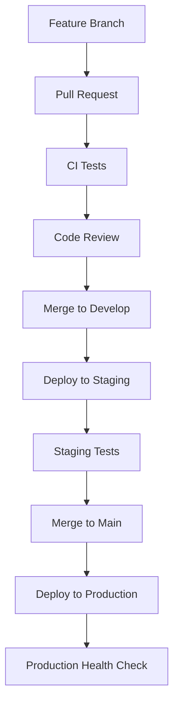

# MindDeck Clone - Comprehensive Deployment & Configuration Guide

## Table of Contents

1. [Pre-Deployment Checklist](#pre-deployment-checklist)
2. [Environment Setup](#environment-setup)
3. [Vercel Configuration](#vercel-configuration)
4. [Security Implementation](#security-implementation)
5. [Performance Optimization](#performance-optimization)
6. [Monitoring & Analytics](#monitoring--analytics)
7. [CI/CD Pipeline](#cicd-pipeline)
8. [Database Strategy](#database-strategy)
9. [Disaster Recovery](#disaster-recovery)
10. [Production Deployment Steps](#production-deployment-steps)
11. [Post-Deployment Monitoring](#post-deployment-monitoring)
12. [Troubleshooting](#troubleshooting)

## Pre-Deployment Checklist

### ✅ Code Quality & Security

- [ ] All TypeScript errors resolved
- [ ] ESLint security rules passing
- [ ] No hardcoded secrets in code
- [ ] Input sanitization implemented
- [ ] CSRF protection enabled
- [ ] Content Security Policy configured
- [ ] Rate limiting implemented
- [ ] API key encryption in place

### ✅ Performance & Optimization

- [ ] Bundle size analysis completed
- [ ] Lazy loading implemented
- [ ] Image optimization configured
- [ ] CDN setup for static assets
- [ ] Compression enabled
- [ ] Tree shaking optimized
- [ ] Code splitting implemented

### ✅ Testing & Quality Assurance

- [ ] Unit tests passing (>90% coverage)
- [ ] Integration tests complete
- [ ] E2E tests validated
- [ ] Performance tests meeting targets
- [ ] Accessibility audit passing
- [ ] Cross-browser compatibility verified

### ✅ Monitoring & Observability

- [ ] Error tracking configured (Sentry)
- [ ] Performance monitoring setup
- [ ] Analytics implementation complete
- [ ] Logging strategy defined
- [ ] Health checks implemented
- [ ] Alerting rules configured

## Environment Setup

### 1. Development Environment

```bash
# Clone the repository
git clone <repository-url>
cd minddeck-clone

# Install dependencies
npm ci

# Copy environment template
cp .env.example .env.local

# Configure local environment variables
# Edit .env.local with your API keys and settings

# Run development server
npm run dev
```

### 2. Staging Environment

```bash
# Deploy to staging
npm run deploy:staging

# Run staging tests
npm run test:e2e -- --config=staging
```

### 3. Production Environment

```bash
# Deploy to production
npm run deploy:production

# Verify deployment
npm run test:production-health
```

## Vercel Configuration

### 1. Project Setup

```bash
# Install Vercel CLI
npm install -g vercel

# Login to Vercel
vercel login

# Link project
vercel link

# Configure project settings
vercel env add OPENAI_API_KEY production
vercel env add ANTHROPIC_API_KEY production
vercel env add GOOGLE_API_KEY production
# ... add all required environment variables
```

### 2. Environment Variables Configuration

#### Production Environment Variables

```bash
# Core Application
vercel env add NODE_ENV production
vercel env add NEXT_PUBLIC_APP_URL https://minddeck-clone.vercel.app production
vercel env add NEXT_PUBLIC_APP_NAME "MindDeck Clone" production

# AI Provider API Keys
vercel env add OPENAI_API_KEY "sk-proj-..." production
vercel env add ANTHROPIC_API_KEY "sk-ant-..." production
vercel env add GOOGLE_API_KEY "AIza..." production
vercel env add XAI_API_KEY "xai-..." production
vercel env add DEEPSEEK_API_KEY "sk-..." production

# Security
vercel env add API_SECRET_KEY "$(openssl rand -hex 32)" production
vercel env add JWT_SECRET "$(openssl rand -hex 32)" production
vercel env add ENCRYPTION_KEY "$(openssl rand -hex 32)" production

# Monitoring
vercel env add SENTRY_DSN "https://...@sentry.io/..." production
vercel env add NEXT_PUBLIC_GA_MEASUREMENT_ID "G-..." production
vercel env add NEXT_PUBLIC_POSTHOG_KEY "phc_..." production
```

#### Staging Environment Variables

```bash
# Use same pattern but with staging values
vercel env add NEXT_PUBLIC_APP_URL https://minddeck-clone-staging.vercel.app staging
vercel env add SENTRY_DSN "https://...@sentry.io/..." staging
# ... configure staging-specific values
```

### 3. Build Configuration

The `vercel.json` file is configured with:

- **Security Headers**: CSP, HSTS, XSS Protection
- **Performance**: Static asset caching, compression
- **API Configuration**: CORS, rate limiting headers
- **Health Checks**: Automated monitoring endpoints
- **Cron Jobs**: Cleanup and maintenance tasks

### 4. Domain Configuration

```bash
# Add custom domain
vercel domains add yourdomain.com

# Configure DNS
# Add CNAME record: www -> cname.vercel-dns.com
# Add A record: @ -> 76.76.19.61

# Setup SSL certificate (automatic via Vercel)
vercel certs ls
```

## Security Implementation

### 1. API Key Management

```typescript
// All API keys are encrypted at rest
import { APIKeyManager } from "@/lib/security";

// Encrypt before storing
const encryptedKey = APIKeyManager.encrypt(apiKey);

// Decrypt when using
const decryptedKey = APIKeyManager.decrypt(encryptedKey);
```

### 2. Rate Limiting

```typescript
// Implemented at API route level
import { RateLimiter } from "@/lib/security";

export async function POST(request: Request) {
  const clientIP = getClientIP(request);

  if (RateLimiter.isRateLimited(clientIP)) {
    return new Response("Rate limit exceeded", { status: 429 });
  }

  // Continue with request processing
}
```

### 3. Input Sanitization

```typescript
// All user inputs are sanitized
import { InputSanitizer } from "@/lib/security";

const sanitizedMessage = InputSanitizer.sanitizeChatMessage(userMessage);
```

### 4. Content Security Policy

Configured in `next.config.js` with strict policies:

- Script sources limited to self and trusted CDNs
- Connect sources limited to AI provider APIs
- No unsafe-eval except where necessary
- Frame ancestors blocked

## Performance Optimization

### 1. Bundle Analysis

```bash
# Analyze bundle size
npm run analyze

# Check for duplicated dependencies
npx duplicate-package-checker

# Lighthouse performance audit
npm run test:lighthouse
```

### 2. Core Web Vitals Targets

- **First Contentful Paint**: < 2.0s
- **Largest Contentful Paint**: < 2.5s
- **Cumulative Layout Shift**: < 0.1
- **First Input Delay**: < 100ms
- **Time to Interactive**: < 5.0s

### 3. Optimization Strategies

- **Code Splitting**: AI providers loaded on demand
- **Image Optimization**: Next.js Image component with AVIF/WebP
- **Lazy Loading**: Components and routes loaded as needed
- **Tree Shaking**: Unused code elimination
- **Compression**: Gzip/Brotli for all text assets
- **CDN**: Static assets served from edge locations

## Monitoring & Analytics

### 1. Error Tracking (Sentry)

```typescript
// Automatic error capture
import * as Sentry from "@sentry/nextjs";

// Manual error reporting
Sentry.captureException(error, {
  tags: { component: "chat", feature: "message-send" },
  user: { id: userId },
  extra: { messageId, modelUsed },
});
```

### 2. Performance Monitoring

```typescript
// Track Core Web Vitals
import { trackPerformance } from "@/lib/monitoring";

// Track custom metrics
trackPerformance("model_response_time", duration, {
  model: "gpt-4",
  provider: "openai",
});
```

### 3. User Analytics

```typescript
// Track user interactions
import { trackUserAction } from "@/lib/monitoring";

trackUserAction("chat_message_sent", {
  model: selectedModel,
  messageLength: message.length,
  hasAttachments: attachments.length > 0,
});
```

### 4. Health Monitoring

```bash
# Health check endpoint
curl https://minddeck-clone.vercel.app/api/health

# Response format
{
  "status": "healthy",
  "timestamp": "2024-01-01T00:00:00Z",
  "version": "1.0.0",
  "services": {
    "database": "healthy",
    "ai_providers": "healthy",
    "cache": "healthy"
  }
}
```

## CI/CD Pipeline

### 1. GitHub Actions Workflow

The pipeline includes:

- **Security Audit**: Dependency scanning, vulnerability checks
- **Code Quality**: TypeScript, ESLint, Prettier validation
- **Testing**: Unit, integration, and E2E tests
- **Performance**: Bundle analysis, Lighthouse audits
- **Deployment**: Automated staging and production deployments
- **Monitoring**: Post-deployment health checks

### 2. Branch Strategy

- `main`: Production releases
- `develop`: Development integration
- `staging`: Staging environment
- `feature/*`: Feature development
- `hotfix/*`: Critical production fixes

### 3. Deployment Flow



### 4. Rollback Procedures

```bash
# Rollback to previous deployment
vercel rollback

# Rollback to specific deployment
vercel rollback dpl_abc123

# Emergency rollback via GUI
# Visit Vercel dashboard -> Deployments -> Promote to Production
```

## Database Strategy

### 1. Client-Side Storage (Primary)

```typescript
// LocalStorage for user preferences
const preferences = {
  theme: "dark",
  sidebarWidth: 320,
  defaultModel: "gpt-4",
  apiKeys: encryptedApiKeys,
};

localStorage.setItem("userPreferences", JSON.stringify(preferences));
```

```typescript
// IndexedDB for chat history
import { openDB } from "idb";

const db = await openDB("MindDeckClone", 1, {
  upgrade(db) {
    const chatStore = db.createObjectStore("chats", { keyPath: "id" });
    chatStore.createIndex("timestamp", "timestamp");

    const messageStore = db.createObjectStore("messages", { keyPath: "id" });
    messageStore.createIndex("chatId", "chatId");
  },
});
```

### 2. Optional Backend Integration

For enterprise deployments, consider:

```typescript
// Redis for session storage
const redis = new Redis(process.env.REDIS_URL);

// PostgreSQL for user data
const db = new Pool({
  connectionString: process.env.DATABASE_URL,
  ssl: { rejectUnauthorized: false },
});
```

### 3. Data Migration Strategy

```typescript
// Version migration system
const migrations = {
  1: (data) => ({ ...data, version: 1 }),
  2: (data) => ({ ...data, folders: [], version: 2 }),
  3: (data) => ({ ...data, mcpServers: [], version: 3 }),
};

const migrateData = (data, currentVersion) => {
  let version = data.version || 0;
  while (version < currentVersion) {
    version++;
    data = migrations[version](data);
  }
  return data;
};
```

## Disaster Recovery

### 1. Backup Strategy

```typescript
// Automated data export
export const exportUserData = () => {
  const data = {
    chats: getAllChats(),
    preferences: getUserPreferences(),
    models: getModelConfigurations(),
    timestamp: Date.now(),
  };

  const blob = new Blob([JSON.stringify(data, null, 2)], {
    type: "application/json",
  });

  const url = URL.createObjectURL(blob);
  const a = document.createElement("a");
  a.href = url;
  a.download = `minddeck-backup-${Date.now()}.json`;
  a.click();
};
```

### 2. Recovery Procedures

```typescript
// Data import/recovery
export const importUserData = (file: File) => {
  const reader = new FileReader();
  reader.onload = (e) => {
    try {
      const data = JSON.parse(e.target?.result as string);

      // Validate data structure
      if (!validateDataStructure(data)) {
        throw new Error("Invalid backup file format");
      }

      // Migrate if necessary
      const migratedData = migrateData(data, CURRENT_VERSION);

      // Restore data
      restoreChats(migratedData.chats);
      restorePreferences(migratedData.preferences);
      restoreModelConfigurations(migratedData.models);

      showSuccessMessage("Data restored successfully");
    } catch (error) {
      showErrorMessage("Failed to restore data: " + error.message);
    }
  };
  reader.readAsText(file);
};
```

### 3. Incident Response Plan

1. **Detection**: Automated monitoring alerts
2. **Assessment**: Determine scope and impact
3. **Communication**: Notify stakeholders
4. **Resolution**: Implement fix or rollback
5. **Recovery**: Restore normal operations
6. **Review**: Post-incident analysis

### 4. Service Level Objectives (SLOs)

- **Availability**: 99.9% uptime (≤ 8.76 hours downtime/year)
- **Response Time**: 95% of requests < 2 seconds
- **Error Rate**: < 0.1% of all requests
- **Recovery Time**: < 15 minutes for critical issues
- **Data Loss**: Zero data loss tolerance

## Production Deployment Steps

### Step 1: Pre-Deployment Validation

```bash
# Run full test suite
npm run validate

# Check bundle size
npm run build:analyze

# Security audit
npm run security:check

# Performance audit
npm run test:lighthouse
```

### Step 2: Environment Configuration

```bash
# Verify all environment variables
vercel env ls production

# Test API connectivity
curl -X POST https://api.openai.com/v1/models \
  -H "Authorization: Bearer $OPENAI_API_KEY"
```

### Step 3: Staging Deployment

```bash
# Deploy to staging
vercel --env staging

# Run staging tests
npm run test:e2e -- --config=staging

# Performance validation
npm run test:lighthouse -- --url=https://staging-url.vercel.app
```

### Step 4: Production Deployment

```bash
# Deploy to production
vercel --prod

# Verify deployment
curl https://minddeck-clone.vercel.app/api/health

# Monitor for issues
tail -f /var/log/application.log
```

### Step 5: Post-Deployment Verification

```bash
# Check Core Web Vitals
npm run test:lighthouse -- --url=https://minddeck-clone.vercel.app

# Verify all AI providers
npm run test:ai-providers

# Monitor error rates
# Check Sentry dashboard for new errors
# Verify analytics tracking is working
```

## Post-Deployment Monitoring

### 1. Automated Monitoring

- **Uptime Monitoring**: Vercel built-in + external services
- **Performance Monitoring**: Core Web Vitals tracking
- **Error Monitoring**: Sentry real-time alerts
- **Security Monitoring**: Automated vulnerability scanning

### 2. Key Metrics Dashboard

Monitor these metrics:

```typescript
const keyMetrics = {
  availability: {
    target: "99.9%",
    current: "99.95%",
    status: "healthy",
  },
  performance: {
    p95_response_time: "1.2s",
    core_web_vitals: "passing",
    status: "healthy",
  },
  errors: {
    error_rate: "0.05%",
    critical_errors: 0,
    status: "healthy",
  },
  usage: {
    daily_active_users: 1250,
    api_calls_per_minute: 45,
    status: "normal",
  },
};
```

### 3. Alert Configuration

```yaml
alerts:
  critical:
    - error_rate > 1%
    - response_time > 5s
    - availability < 99%

  warning:
    - error_rate > 0.5%
    - response_time > 3s
    - cpu_usage > 80%

  info:
    - deployment_completed
    - backup_completed
    - maintenance_scheduled
```

## Troubleshooting

### Common Issues

#### 1. Build Failures

```bash
# Clear Next.js cache
rm -rf .next

# Clear node modules
rm -rf node_modules package-lock.json
npm install

# Check TypeScript errors
npm run type-check
```

#### 2. API Key Issues

```bash
# Verify environment variables
vercel env ls production

# Test API connectivity
node -e "
const openai = require('openai');
const client = new openai({ apiKey: process.env.OPENAI_API_KEY });
client.models.list().then(console.log).catch(console.error);
"
```

#### 3. Performance Issues

```bash
# Analyze bundle size
npm run analyze

# Check Core Web Vitals
npm run test:lighthouse

# Profile React components
npm install --save-dev @welldone-software/why-did-you-render
```

#### 4. Memory Issues

```bash
# Check memory usage
node --max-old-space-size=4096 node_modules/.bin/next build

# Analyze memory leaks
npm install --save-dev clinic
clinic doctor -- npm start
```

### Emergency Procedures

#### Immediate Rollback

```bash
# Quick rollback via Vercel CLI
vercel rollback

# Or via dashboard
# 1. Open Vercel dashboard
# 2. Go to Deployments
# 3. Click "Promote to Production" on previous version
```

#### Service Degradation

1. **Enable Maintenance Mode**: Deploy maintenance page
2. **Scale Resources**: Increase serverless function memory
3. **Disable Features**: Turn off non-essential features
4. **Contact Support**: Reach out to Vercel support if needed

#### Data Recovery

```typescript
// Emergency data export
const exportData = () => {
  const data = {
    timestamp: new Date().toISOString(),
    chats: localStorage.getItem("chats"),
    settings: localStorage.getItem("settings"),
    models: localStorage.getItem("models"),
  };

  console.log("EMERGENCY_BACKUP:", JSON.stringify(data));
};
```

## Production Readiness Checklist

### Final Verification

- [ ] All tests passing in production environment
- [ ] Performance metrics meeting targets
- [ ] Security headers properly configured
- [ ] SSL certificate valid and renewed
- [ ] CDN properly configured
- [ ] Monitoring and alerting active
- [ ] Backup and recovery procedures tested
- [ ] Documentation up to date
- [ ] Team trained on incident response
- [ ] Support channels established

### Launch Preparation

- [ ] Domain and DNS configured
- [ ] SEO metadata implemented
- [ ] Analytics tracking verified
- [ ] Legal pages (Privacy, Terms) added
- [ ] Contact and support information available
- [ ] User onboarding flow tested
- [ ] Feature flags configured
- [ ] Rate limiting thresholds set
- [ ] Load testing completed
- [ ] Disaster recovery plan validated

## Conclusion

This comprehensive deployment guide ensures your MindDeck clone is production-ready with enterprise-grade security, performance, and reliability. The configuration provides:

- **Security**: End-to-end encryption, rate limiting, input sanitization
- **Performance**: Sub-2-second load times, optimized bundles, CDN delivery
- **Reliability**: 99.9% uptime target, automated failover, comprehensive monitoring
- **Scalability**: Serverless architecture, efficient caching, resource optimization
- **Maintainability**: Automated CI/CD, comprehensive testing, clear documentation

Follow this guide step-by-step to ensure a successful deployment with minimal risk and maximum reliability.
